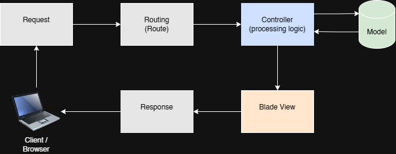
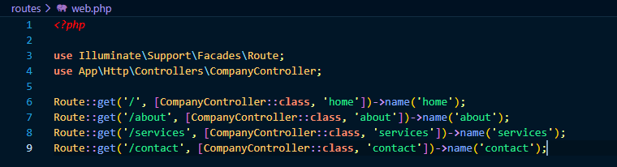

# Aeolus Digital - Company Profile Website

## 1. Project Title

**Aeolus Digital - Corporate Profile Website**  
*Built with Laravel 11, Blade Templating, and Tailwind CSS v4*

**Subject:** ITST 302 — Client-Server Technologies  
**Project:** Mini Project 02: Company Profile Website using Laravel MVC  
**Course:** Bachelor of Science in Information Technology (BSIT)  

---

## 2. Introduction

A Corporate Profile Website serves as an enterprise's official digital identity. It provides prospective clients, partners, and stakeholders with comprehensive information regarding a business's core services, organizational values, technical expertise, and contact channels.

Businesses require a modern profile website to establish authority, maintain customer trust, and showcase brand capabilities in a competitive market. The purpose of this project is to implement a multi-page, responsive web application using Laravel's Model-View-Controller (MVC) architecture, demonstrating clean client-server request processing, route definitions, reusable layout templating, and structured code separation.

---

## 3. Objectives

* Build a responsive multi-page corporate web application using Laravel.
* Implement custom routes mapping HTTP GET requests to specific controller methods.
* Utilize the Blade Templating Engine to build modular, non-redundant layouts and components (`app.blade.php`, `navbar`, `footer`).
* Maintain clean code organization by enforcing Laravel's separation of concerns.
* Configure static asset management using Vite and Tailwind CSS v4.
* Document development workflows and maintain structured version control using Git and GitHub.

---

## 4. MVC Architecture

**Model-View-Controller (MVC)** is a software architectural pattern that separates an application into three interconnected components:

* **Model:** Handles data logic, database queries, and business rules.
* **View:** Manages the user interface (UI) and layout presentation (HTML/Blade).
* **Controller:** Acts as an intermediary; receives incoming HTTP requests, executes business logic, and returns the appropriate view or data response.

### Why Laravel Uses MVC
Laravel adopts MVC to promote **Separation of Concerns**. By keeping presentation markup isolated from application logic, developers can modify UI components without risking breaking backend functionality or route handling.

### Advantages of MVC
1. **Maintainability:** Modular components make codebases easier to debug, refactor, and scale.
2. **Reusability:** Layouts, navigation bars, and headers can be shared across multiple views.
3. **Parallel Development:** Frontend developers can design Blade views simultaneously as backend engineers construct controllers and database logic.

### Request Flow Diagram

---

## 5. Laravel Routing

Routing defines how an application responds to client requests for specific URL paths. In Laravel, routes are defined inside `routes/web.php`.

* **Named Routes:** Allows developers to reference URLs by name (e.g., `route('services')`), ensuring that changing URL path strings in `web.php` won't break application navigation links.
* **GET Requests:** Handles standard HTTP GET calls used to fetch and display dynamic views.
* **Route Definitions:** The actual PHP declarations in `routes/web.php` that map individual paths (`/`, `/about`, `/services`, `/contact`) to their respective `CompanyController` methods.

---

## 6. Controllers
Controllers organize route handling logic into dedicated PHP classes instead of defining inline closures in `routes/web.php`.

---

## 7. Blade Templating Engine
Blade is Laravel's powerful templating engine. It compiles template markup into plain PHP code and introduces dynamic layout syntax:

* **`@extends('layouts.app')`:** Inherits a master layout structure.
* **`@section('content')`:** Defines a block of content injected into a parent layout.
* **`@yield('content')`:** Creates a dynamic placeholder inside master layouts for child views to populate.
* **`@include('components.navbar')`:** Embeds modular, reusable Blade components.

---

## 8. Laravel Folder Structure

* **`app/`:** Contains the core application logic, including HTTP Controllers (`app/Http/Controllers`), Middlewares, and Models.
* **`routes/`:** Contains all route definitions (`web.php, api.php, console.php`).
* **`resources/`:** Houses views (`resources/views/`), uncompiled CSS/JS files (`resources/css/, resources/js/`), and translation strings.
* **`public/`:** Stores public web assets accessible directly by browsers, including compiled assets, uploaded files, and image directories (public/images/).
* **`bootstrap/`:** Handles framework bootstrapping and auto-loading initialization scripts (`app.php`).
* **`config/`:** Contains global configuration options for app behavior, databases, session handling, and services.

---

## 9. Screenshots
| Screenshot Asset | Visual Preview |
| :--- | :---: |
| **Home Page** |  |
| **About Page** |  |
| **Services Page** |  |
| **Contact Page** |  |
| **Navigation Bar** |  |
| **Footer** |  |
| **Route Definitions** |  |
| **Controller** |  |
| **Blade Layout** |  |

---

## 10. Problems Encountered
1. **Target Class [CompanyController] Does Not Exist:**  
   Occurred during initial route testing due to missing controller import statements in `routes/web.php`.

2. **Missing Asset Compilation Errors:**  
   Tailwind v4 utility styles were not rendering initially due to mismatched asset imports in `app.blade.php` and missing `@import "tailwindcss";` statements in `resources/css/app.css.`

3. **Broken Image Relative Paths:**  
   Custom social media PNG icons failed to display on dynamic subpages when using relative asset paths.

---

## 11. Solutions

1. Implemented explicit Controller namespace imports at the top of web.php using use App\Http\Controllers\CompanyController;.

2. Cleaned redundant default CSS files (`style.css`), properly configured `@import "tailwindcss";` inside `app.css`, and ensured `@vite(['resources/css/app.css', 'resources/js/app.js'])`
   was called within the HTML `<head>`.

3. Converted relative image sources to Laravel’s built-in `asset('images/filename.png')` Blade helper to properly resolve asset paths relative to the `public/` directory.

---

## 12. Reflection

Developing our project using Laravel MVC really helped me understand how backend web development works in real life. At first, it was kind of confusing to figure out how everything connects, but working through it step-by-step made the whole structure make a lot more sense.

I learned that MVC stands for Model-View-Controller, and it is basically a way to organize code into three main parts so that everything has its own job. The Model deals with the data, the View is what the user sees on the screen, and the Controller acts like a middleman that manages what happens when a user clicks something. Before using MVC, it was easy to get overwhelmed trying to fit everything into single files. Learning MVC showed me how professional web applications are actually built.

Separation of concerns is important because keeping code organized prevents a lot of big headaches later on. If you mix your database logic, page styling, and application rules all in one place, the code gets super messy very fast. If you want to change a button or fix a bug, you might accidentally break something completely unrelated. Separating everything means you can work on the design without touching the core logic, or update the backend without messing up how the page looks. It also keeps you from duplicating layout code like headers and footers across every single page. Using Blade features like @extends and @yield allows us to reuse layout pieces easily so we do not have to copy and paste the same code over and over again.

They work together in a clear, step-by-step chain whenever someone uses the website. It starts when a user opens a page in their browser, which sends a request to the web app. The Route receives that request first and figures out where it needs to go. Then, the route sends it to the right method in the Controller. The controller handles the main work or decision-making, like grabbing data if needed, and then tells the View what to show. Finally, the Blade View takes that information, turns it into a full webpage, and sends it back to the browser for the user to see.

When projects grow into larger enterprise systems, this architecture makes scaling up much easier and less risky. In a big system with many pages and users, multiple developers are usually working on the project at the same time. Because the application is split into distinct parts, backend developers can build new database features or create APIs without getting in the way of frontend developers who are working on the user interface. It makes the system easier to test, update, and maintain over time without causing the whole application to crash when adding new features.

## 13. References

* Laravel. (n.d.). *Laravel documentation: Routing*. https://laravel.com/docs/routing
* Laravel. (n.d.). *Laravel documentation: Controllers*. https://laravel.com/docs/controllers
* Laravel. (n.d.). *Laravel documentation: Blade templates*. https://laravel.com/docs/blade
* Tailwind Labs. (n.d.). *Tailwind CSS documentation*. https://tailwindcss.com/docs